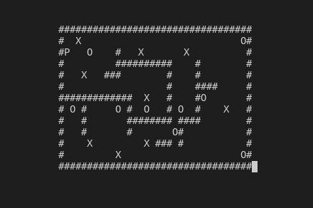

# my_sokoban


<!-- ABOUT THE PROJECT -->
## About The Project
The player is confined to the board, and may move horizontally or vertically onto empty squares (never through walls or boxes). The player can also move into a box, which pushes it into the square beyond. Boxes may not be pushed into other boxes or walls, and they cannot be pulled. The number of boxes is equal to the number of storage locations. The puzzle is solved when all boxes are at storage locations, the puzzle is failed if all boxes are stuck.

<!-- REQUIREMENTS -->
## Requirements
* GCC
* NCURSES library

<!-- GETTING STARTED -->
## Getting Started
Execute ```make``` then ```./my_sokoban map.txt```

You can edit the map file representing the warehouse map, it must have the same amount of boxes `X` and storage locations `O`. The player is represented by a `P` and walls by `#`.


